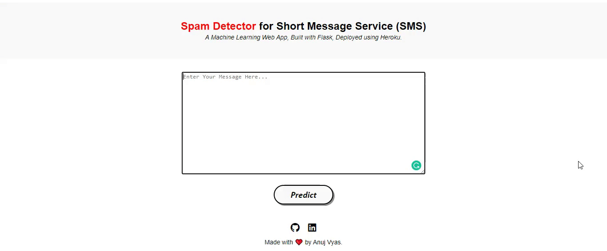
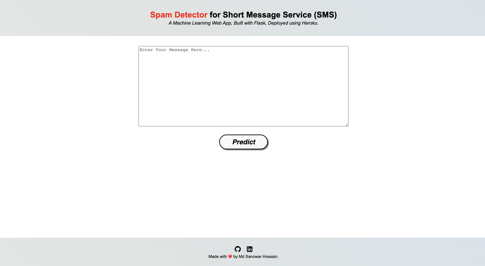

# Build-Text-Classified-MLModel
This project developed an end-to-end text classification model utilizing the Kaggle spam-ham text message dataset, Machine Learning techniques, the Flask API for Web Applications, and deployment on cloud platforms like as Heroku and AWS Elastic Beam.

# Spam SMS Classification - Deployment
  

• This repository consists of files required to deploy a ___Machine Learning Web App___ created with ___Flask___ on ___Heroku___ platform.

• If you want to view the deployed model, click on the following link: 
Deployed at: _https://spam-sms-detector.herokuapp.com/_

• Please do ⭐ the repository, if it helped you in anyway.

• A glimpse of the web app:

